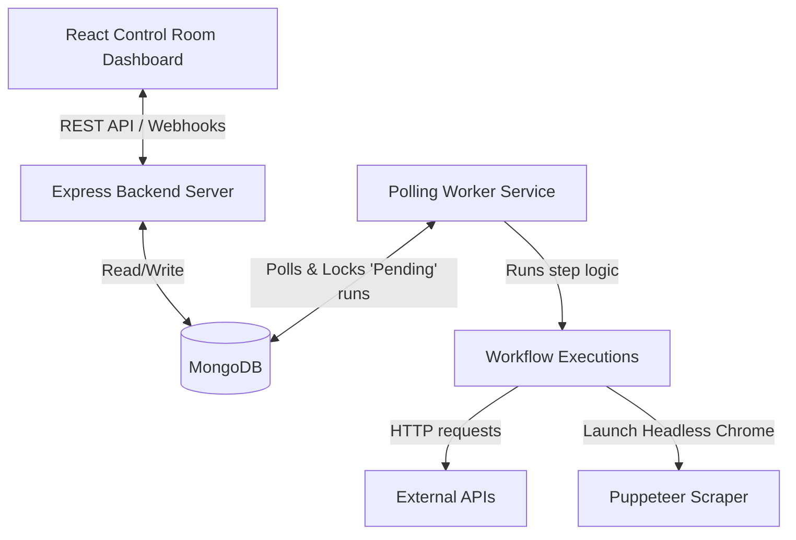

# NexusEngine Workflow Platform

A full-stack, monorepo-based workflow automation and orchestration engine. NexusEngine executes multi-step logic sequences sequentially in the background using a distributed-style polling task worker, stores detailed execution telemetry and logs in MongoDB, and presents a glassmorphic React control room dashboard.

---

## Table of Contents
1. [Key Features](#key-features)
2. [Architecture Overview](#architecture-overview)
3. [Monorepo Directory Structure](#monorepo-directory-structure)
4. [Database Models & Schema Specifications](#database-models--schema-specifications)
5. [Workflow Nodes & Execution Logic](#workflow-nodes--readme-detail-nodes)
6. [The Polling Engine Worker](#the-polling-engine-worker)
7. [API Endpoints](#api-endpoints)
8. [Local Development & Setup](#local-development--setup)
9. [Docker Deployment](#docker-deployment)

---

## Key Features

- **Sequential Step Engine**: Executes Node workflows based on logical step links, passing state/inputs forward.
- **Detached Polling Worker**: A background polling runner retrieves and processes executions without blocking the Web server threads.
- **Node Integrations**:
  - **HTTP Node**: Communicates with third-party endpoints using `axios` with configured retries.
  - **Web Scraper Node**: Dynamically spawns a headless Chromium instance using `puppeteer` to scrape text matching selectors.
  - **Data Transformer Node**: Filters, restructures, and maps JSON fields for down-stream nodes.
- **Live Debugger and Telemetry**: Logs start-to-finish steps, inputs, outputs, execution time, and raw error traces.
- **Modern Control Room UI**: Sleek React/Vite web application using Tailwind CSS v4, custom glassmorphism components, workflow visualizers, execution distribution heatmaps, and a visual canvas node editor.

---

## Architecture Overview



---

## Monorepo Directory Structure

NexusEngine is structured as a monorepo utilizing `npm workspaces`:

```text
Agentic-loop/
├── package.json          # Monorepo workspaces definition
├── package-lock.json
├── context.md            # Detailed platform specs & specifications
├── Dockerfile            # Multi-stage production container setup
├── docker-compose.yml    # Single command container build
├── backend/              # Node/Express Server + Background Polling Worker
│   ├── package.json
│   ├── tsconfig.json
│   └── src/
│       ├── index.ts      # Server entrypoint (initializes DB & starts PollingWorker)
│       ├── config/       # MongoDB Mongoose configurations
│       ├── models/       # Mongoose Schemas (Workflow, Execution, ExecutionLog)
│       ├── routes/       # Express route handlers (workflows, webhooks, executions)
│       └── worker/       # Polling engine worker & action run scripts
└── frontend/             # Vite + React 19 Frontend Web Client
    ├── package.json
    ├── vite.config.ts
    ├── index.html
    └── src/              # App router, pages, dashboards, CSS layouts
```

---

## Database Models & Schema Specifications

The engine relies on three strict Mongoose schemas:

### 1. Workflow Schema (`Workflow.ts`)
Defines the template blueprint for the sequence of nodes.
- **`name`** (`String`, Required): Title of the workflow.
- **`isActive`** (`Boolean`, Default `true`): Toggles whether the workflow can run.
- **`nodes`** (`Array`): Array of node objects containing:
  - `id` (`String`, Required): Unique string identifier for the node within the workflow.
  - `type` (`String`, Required): Must be one of `HTTP`, `Scraper`, or `Transformer`.
  - `config` (`Schema.Types.Mixed`, Default `{}`): Node specific configurations (e.g. headers, URLs, selectors, extraction keys).
  - `next` (`Array<String>`): List of downstream node IDs executing sequentially after this node succeeds.

### 2. Execution Schema (`Execution.ts`)
Tracks the status and history of individual workflow runs.
- **`workflowId`** (`Schema.Types.ObjectId`, Ref `Workflow`, Required): Associated workflow.
- **`status`** (`String`, Default `'Pending'`): Current execution state. Allowed values: `Pending`, `Running`, `Success`, `Failed`.
- **`startedAt`** (`Date`): Timestamp when worker sets status to `Running`.
- **`completedAt`** (`Date`): Timestamp when workflow finishes or fails.
- **`triggerData`** (`Schema.Types.Mixed`, Default `{}`): The initial payload sent to run the workflow (e.g., webhook body).

### 3. ExecutionLog Schema (`ExecutionLog.ts`)
Step-by-step logs for node-level telemetry and debugger tracking.
- **`executionId`** (`Schema.Types.ObjectId`, Ref `Execution`, Required): Associated run tracker.
- **`workflowId`** (`Schema.Types.ObjectId`, Ref `Workflow`, Required): Parent workflow blueprint.
- **`nodeId`** (`String`, Required): The ID of the node that executed.
- **`status`** (`String`, Required): Result state: `Success` or `Failed`.
- **`inputData`** (`Schema.Types.Mixed`): Inputs passed to the node.
- **`outputData`** (`Schema.Types.Mixed`): Outputs returned by the node.
- **`error`** (`String`): Catch-all block for errors, stack traces, and fail diagnostics.
- **`startedAt`** (`Date`): Timestamp of node execution startup.
- **`completedAt`** (`Date`): Timestamp of node completion.

---

## Workflow Nodes & Execution Logic

### 1. HTTP Node
Used to query or send payloads to third-party endpoints.
- **Config options**: `url` (String), `method` (GET/POST/PUT/DELETE), `headers` (JSON), `body` (JSON/Mixed).
- **Execution behavior**: Executes requests using `axios`.
- **Retry Logic**: If a network failure occurs, the engine retries the request up to **3 times** with a **2-second delay** between attempts.

### 2. Web Scraper Node
Used to extract content from client-rendered websites.
- **Config options**: `url` (String), `selector` (String - CSS selector).
- **Execution behavior**: Spawns a headless browser instance using `puppeteer`. Waits up to **30 seconds** for the page to reach `networkidle2`.
- **Extraction**: If a `selector` is configured, it queries the page DOM and extracts the text contents. Otherwise, it extracts the page title and the final loaded URL.

### 3. Data Transformer Node
Used to clean and map responses before downstream nodes receive them.
- **Config options**: `extractKey` (String).
- **Execution behavior**: Parses the incoming data payload and filters out everything except the nested key specified in `extractKey`.
- **Outputs**: Returns the nested object and appends a `_transformedAt` timestamp.

---

## The Polling Engine Worker

To prevent API requests from blocking server processes, workflow execution is fully delegated to `pollingWorker.ts`:

1. **Scheduling Interval**: Runs on a continuous loop every **5 seconds** inside the Express backend process.
2. **Locking Mechanism**: Uses MongoDB transactions to fetch and immediately lock the oldest `Pending` execution:
   ```typescript
   Execution.findOneAndUpdate(
     { status: 'Pending' },
     { status: 'Running', startedAt: new Date() },
     { new: true, sort: { createdAt: 1 } }
   )
   ```
3. **Overlapping Prevention**: Uses an `isPolling` flag internally to prevent subsequent loops from running if a previous fetch query is still in flight.
4. **Execution Flow**: Spawns `executeWorkflow(execution)` asynchronously in the background. If any node throws an unhandled error after retries, the execution is marked as `Failed`, outputs are written to `ExecutionLog`, and downstream executions are immediately halted.

---

## API Endpoints

### Workflow Management
- `GET /api/workflows` — List all workflows.
- `GET /api/workflows/:id` — Retrieve workflow configuration.
- `POST /api/workflows` — Create a new workflow template.
- `PUT /api/workflows/:id` — Update workflow settings or node trees.
- `DELETE /api/workflows/:id` — Remove a workflow template.

### Webhook Triggers
- `POST /api/webhooks/:workflowId` — Queue a workflow. Creates a `Pending` execution using the request body as `triggerData`.

### Executions
- `GET /api/executions` — List workflow runs and status.
- `GET /api/executions/:id/logs` — Retrieve node-by-node execution logs for the debugger.

---

## Local Development & Setup

### Prerequisites
- **Node.js** (v18 or higher)
- **MongoDB** running locally (`mongodb://localhost:27017/workflow-engine`) or MongoDB Atlas string.

### 1. Installation
Run the following from the root workspace directory to install all monorepo dependencies:
```bash
npm install
```

### 2. Configure Environment variables
Create a `.env` file inside the `backend` folder:
```env
PORT=5000
MONGODB_URI=mongodb://localhost:27017/workflow-engine
```

### 3. Run Backend (Express API & Polling Worker)
```bash
cd backend
npm run dev
```

### 4. Run Frontend (React Dashboard)
```bash
cd frontend
npm run dev
```
Open `http://localhost:5173` in your browser.

---

## Docker Deployment

NexusEngine provides a production-ready, multi-stage Docker setup. It builds the Vite assets, compiles TypeScript, and packages a headless Chromium dependency for Puppeteer inside a lightweight container image.

### Build and Run with Docker Compose

1. Build the image locally:
   ```bash
   docker-compose build
   ```
2. Start the services:
   ```bash
   docker-compose up
   ```
This maps Port `5000` for both the backend API and the static React asset hosting.
